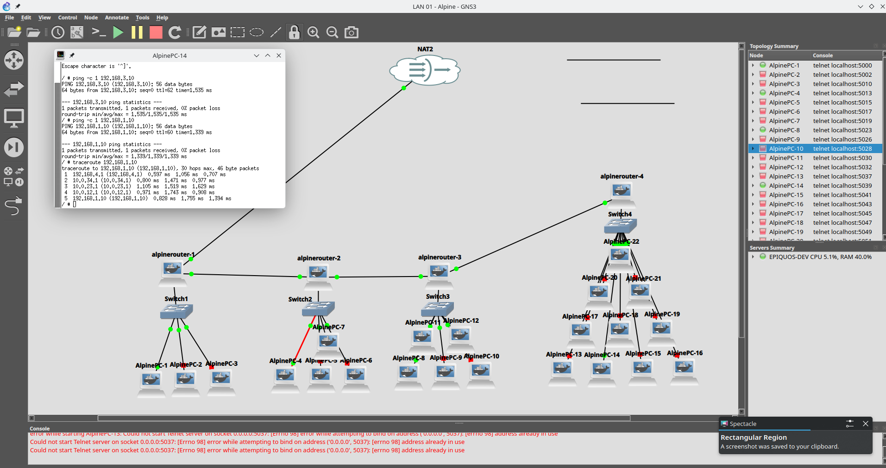

#Four-LAN Routing Lab with GNS3

This project demonstrates a manually configured four-LAN network in GNS3 using Alpine Linux hosts and routers, static IPv4 addressing, /30 router-to-router transit networks, and end-to-end routing verified with ping and traceroute.

## Skills Demonstrated

- TCP/IP addressing and subnetting

- Static routing between multiple IPv4 subnets

- Linux network configuration and troubleshooting

- Routing-table analysis using `ip route` and `ip route get`

- ARP and neighbor-table analysis using `ip neigh`

- Packet-path verification using `ping` and `traceroute`

- Packet inspection with Wireshark

- Ethernet switching, MAC addressing, and local Layer 2 forwarding

- Basic NAT, default gateway, and multi-hop routing concepts

## Network Topology

The lab contains four separate IPv4 LANs connected through four Linux routers. The routers communicate across dedicated /30 transit networks, and static routes allow hosts on each LAN to reach the others.

```text

LAN1                 Transit 1             LAN2                 Transit 2             LAN3                 Transit 3             LAN4

PC1                                                                                                                             PC14
192.168.1.10                                                                                                                     192.168.4.10
   |                                                                                                                                 |
Switch1                                                                                                                          Switch4
   |                                                                                                                                 |
Router1               10.0.12.0/30          Router2               10.0.23.0/30          Router3               10.0.34.0/30          Router4
192.168.1.1      10.0.12.1 <----> 10.0.12.2  192.168.2.1      10.0.23.1 <----> 10.0.23.2  192.168.3.1      10.0.34.1 <----> 10.0.34.2  192.168.4.1
                                              |                                          |
                                           Switch2                                    Switch3
                                              |                                          |
                                           PC4                                        PC8
                                      192.168.2.10                               192.168.3.10

```text
```
## IP Addressing

| Device | Interface | IP Address | Subnet | Default Gateway |
|---|---|---|---|---|
| AlpinePC-1 | eth0 | 192.168.1.10 | 192.168.1.0/24 | 192.168.1.1 |
| Router1 | eth0 | 192.168.1.1 | 192.168.1.0/24 | — |
| Router1 | eth2 | 10.0.12.1 | 10.0.12.0/30 | — |
| Router2 | eth1 | 10.0.12.2 | 10.0.12.0/30 | — |
| Router2 | eth0 | 192.168.2.1 | 192.168.2.0/24 | — |
| Router2 | eth2 | 10.0.23.1 | 10.0.23.0/30 | — |
| Router3 | eth1 | 10.0.23.2 | 10.0.23.0/30 | — |
| Router3 | eth0 | 192.168.3.1 | 192.168.3.0/24 | — |
| Router3 | eth2 | 10.0.34.1 | 10.0.34.0/30 | — |
| Router4 | eth1 | 10.0.34.2 | 10.0.34.0/30 | — |
| Router4 | eth0 | 192.168.4.1 | 192.168.4.0/24 | — |
| AlpinePC-8 | eth0 | 192.168.3.10 | 192.168.3.0/24 | 192.168.3.1 |
| AlpinePC-14 | eth0 | 192.168.4.10 | 192.168.4.0/24 | 192.168.4.1 |
| AlpinePC-4 | eth0 | 192.168.2.10 | 192.168.2.0/24 | 192.168.2.1 |

## Lab Evidence


